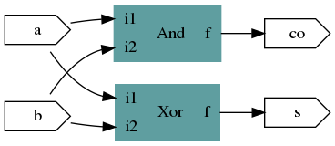
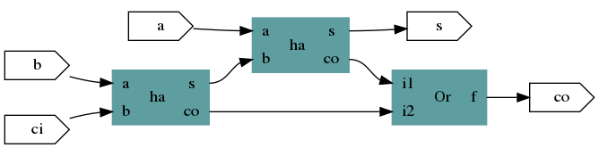

# RTL Circuit

## What is it ?
**rtl_circuit** is a simple Ruby gem that helps me manipulate simple digital circuits. It is used essentially as a _library_ and as such, used by other tools of my own (like my experimental [Synchrony DSL](https://github.com/JC-LL/synchrony))

### features :
- basic library components (logic gates, DFF, mux,...)
- port-based interconnect
- hierarchical composition (building a circuit based on existing )
- json serialization
- viewing : graphviz
- ambryonic SVG place & route

## How to use

Here the programmatic construction of a Half Adder, followed by a Full-adder.
This can be seen as a 'hello world' of digital circuits.

```(ruby)
require 'rtl'  # note that the library is named 'rtl' while the gem is _rtl_circuit_

include RTL    # module loaded

ha=Circuit.new("ha")
ha.add a =Port.new(:in,"a")
ha.add b =Port.new(:in,"b")
ha.add s =Port.new(:out,"s")
ha.add co=Port.new(:out,"co")
ha.add and_=And.new
ha.add xor_=Xor.new

a.connect and_.port("i1")
b.connect and_.port("i2")
a.connect xor_.port("i1")
b.connect xor_.port("i2")
xor_.port("f").connect s
and_.port("f").connect co

printer=Printer.new
printer.print ha
```
.

Now, let's try a Full-adder (made of two Half-adders).

```
fa=Circuit.new("fa")
fa.add a =Port.new(:in,"a")
fa.add b =Port.new(:in,"b")
fa.add ci=Port.new(:in,"ci")
fa.add s= Port.new(:out,"s")
fa.add co=Port.new(:out,"co")

fa.add ha_1=ha.new_instance
fa.add ha_2=ha.new_instance

fa.add or_=Or.new
a.connect  ha_2.port('a')
b.connect  ha_1.port('a')
ci.connect ha_1.port('b')
ha_1.port('s').connect ha_2.port('b')
ha_2.port('co').connect or_.port('i1')
ha_1.port('co').connect or_.port('i2')
or_.port('f').connect fa.port('co')
ha_2.port('s').connect fa.port('s')

printer.print fa

```
.
## How to install ?

```
gem install rtl_circuit
```

## Contact

email : jean-christophe.le_lann at ensta-bretagne dot fr.
